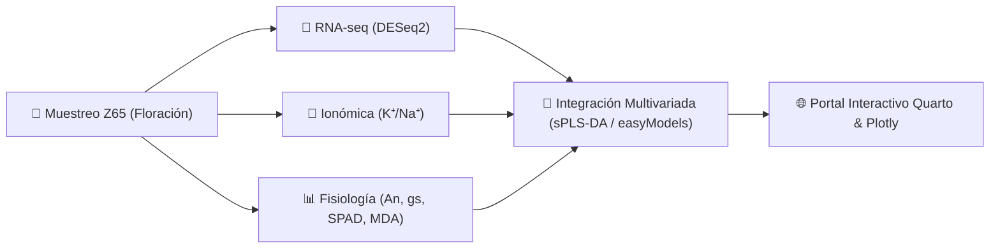

<div align="center">
  
</div>

<div align="center">

# 🌾 Triticum Tale: Data Art & Explorador Multi-Ómico

### Plataforma Científica e Interactiva de Respuestas a Estrés Abiótico en Trigo Candeal (*Triticum durum*)

[](LICENSE)
[](https://quarto.org)
[](https://palp31.github.io/Triticum-tale-web/)
[](https://github.com/PALP31/easyModels)
[](https://www.uc.cl/)

</div>

---

**Triticum Tale** es una plataforma de visualización científica, bioinformática y "Data Art" desarrollada por **Paúl Alexander López Peña** (Pontificia Universidad Católica de Chile).

El proyecto integra datos **transcriptómicos (RNA-seq)**, **perfiles ionómicos ($K^+/Na^+$)**, **biomarcadores de estrés oxidativo (MDA, prolina)** y **rendimiento agronómico** para explorar y comunicar cómo el trigo candeal responde y se adapta frente a olas de calor y sequía extrema en fases fenológicas críticas (Antesis Z65).

---

## 🎯 Los Tres Hallazgos Clave

1. **🔥 Reprogramación Transcriptómica Rápida:** Sobreexpresión superior a 12 veces en chaperonas moleculares (HSP70/HSP90) y factores de transcripción Hsf en genotipos tolerantes durante la antesis ($Z65$).
2. **🧪 Homeostasis Ionómica & Protección Antioxidante:** Fuerte correlación inversa ($r = -0.84$) entre la retención foliar de $K^+$ y la peroxidación lipídica de membranas (MDA), preservando la integridad del fotosistema II.
3. **🌾 Resiliencia del Rendimiento de Grano:** Los genotipos tolerantes preservan más del $83\%$ de su productividad en floración frente a pérdidas superiores al $60\%$ en genotipos sensibles.

---

## 🔬 Enfoque Metodológico Multi-Ómico



* **Bioinformática & Expresión Génica:** Cuantificación transcriptómica, análisis de expresión diferencial (`DESeq2`) y reducción de dimensionalidad (`mixOmics`, `FactoMineR`).
* **Modelado Estadístico:** Modelos lineales mixtos (LMM) para controlar efectos de bloques y medidas temporales (`lme4`, `easyModels`).
* **Visualización Dinámica:** Gráficos vectoriales e interactivos con `ggplot2` y `plotly`.

---

## 📂 Estructura del Repositorio

```
Triticum-tale-web/
├── analysis/
│   ├── 01_data_prep.R          # Limpieza, normalización y control de calidad
│   └── data/
│       ├── raw/                # Datos crudos inmutables
│       └── processed/          # Matrices de datos estandarizadas
├── docs/
│   ├── _quarto.yml             # Configuración del portal web y navegación
│   ├── custom.scss             # Sistema de diseño, tokens SCSS y paletas HSL
│   ├── index.qmd               # Página principal y narrativa multi-ómica
│   ├── heat-stress.qmd         # Desglose transcriptómico y Volcano plots
│   └── drought-stress.qmd      # Ajuste osmótico y dinámicas de prolina
└── assets/                     # Recursos visuales y Data Art
```

---

## 💻 Ejecución Local del Sitio Web

Para compilar y visualizar el portal localmente en tu navegador:

```bash
# 1. Clonar repositorio
git clone https://github.com/PALP31/Triticum-tale-web.git

# 2. Entrar a la carpeta
cd Triticum-tale-web/docs

# 3. Previsualizar con Quarto
quarto preview
```

---

## 👨‍🔬 Autor & Contacto

**Paúl Alexander López Peña**  
*Profesor de Aplicaciones Estadísticas (Pregrado) • Estudiante de Doctorado en Biotecnología Vegetal*  
**Pontificia Universidad Católica de Chile (PUC)**  
Email: [paullopezpena@gmail.com](mailto:paullopezpena@gmail.com) | [plopezp7@estudiante.uc.cl](mailto:plopezp7@estudiante.uc.cl)  
GitHub: [@PALP31](https://github.com/PALP31)
